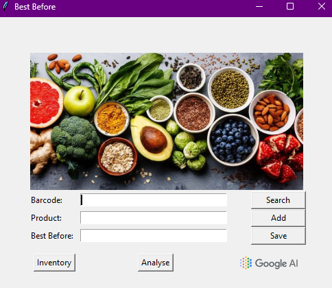

# Best Before Inventory Management System

## Overview
The **Best Before Inventory Management System** is a Python-based desktop application designed to manage product inventories using barcodes. It allows users to add products, track their expiration dates, analyze expiration trends, and generate recipe suggestions using Google Gemini AI for items close to their expiration dates.



## Features
- **Barcode Database Integration:** Add and retrieve product information using barcodes.
- **Expiration Date Tracking:** Save and organize products based on their "Best Before" dates.
- **Inventory Display:** View all products along with their expiration dates in a sortable list.
- **Data Visualization:** Analyze the distribution of products according to expiration dates using graphical charts.
- **AI-Powered Recipe Suggestions:** Generate recipes for products nearing expiration via Google Gemini AI.

## Technologies Used
- **Python 3**
- **Tkinter:** GUI development
- **Pandas:** Data manipulation
- **Seaborn & Matplotlib:** Data visualization
- **Google Generative AI (Gemini):** Recipe generation
- **Pillow (PIL):** Image handling

## Installation & Setup
1. **Prerequisites:**
   - Python 3.x
   - Install required libraries:
     ```bash
     pip install pandas pillow matplotlib seaborn google-generativeai
     ```
2. **File Structure:**
   - `barcode_database.csv`: Database file for barcodes and product names.
   - `best_before.csv`: Stores product names with their expiration dates.
   - `food_image400x200.png`: Main UI image.
   - `google_ai_logo_mini.png`: Google AI logo for the AI button.

3. **API Configuration:**
   - Replace `API KEY HERE` with your Google Gemini API key in the code.

## How to Use
1. **Add Products:**
   - Enter the product barcode and name.
   - Click **Add** to save to the database.

2. **Search Product:**
   - Enter the barcode and click **Search** to retrieve product details.

3. **Track Expiration Date:**
   - Enter the product and its "Best Before" date in `DD/MM/YYYY` format.
   - Click **Save** to store the data.

4. **View Inventory:**
   - Click **Inventory** to see all products and their expiration dates.

5. **Analyze Data:**
   - Click **Analyse** to view expiration trends in a scatter plot.

6. **Generate Recipes:**
   - Click the **Google AI logo** to receive recipes for products expiring within 15 days.

## Example CSV Format
**barcode_database.csv:**
```
Barcode_ID,Product_Name
1234567890123,Milk
9876543210987,Bread
```

**best_before.csv:**
```
Product_Name,Best_Before
Milk,2024-06-13
Bread,2024-06-25
```

## License
This project is open-source and available for educational and personal use.

## Acknowledgments
- Python Community for providing excellent libraries.
- Google Generative AI for recipe suggestions.

For any issues, feel free to open an issue or suggest improvements!

